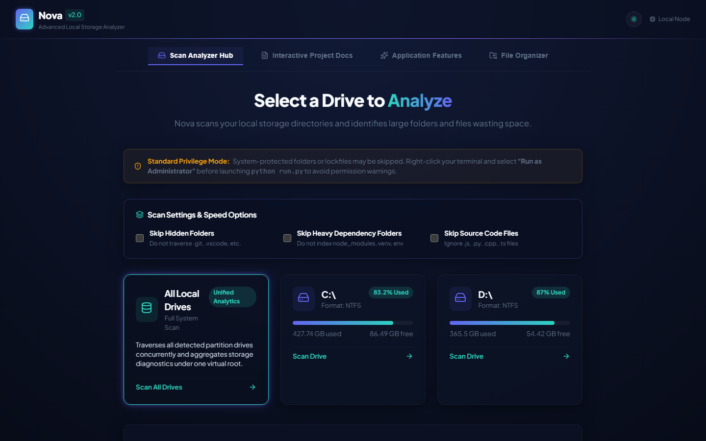
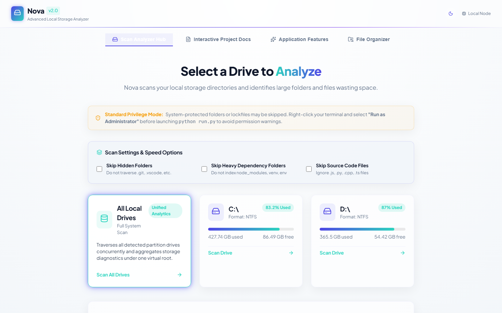
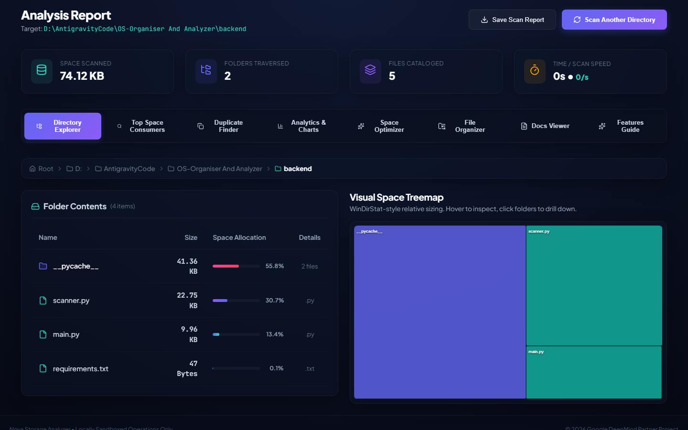
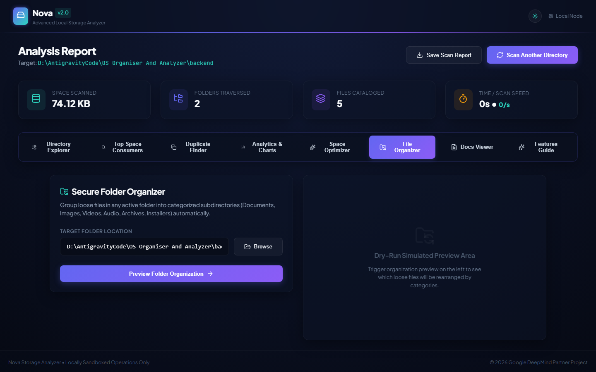
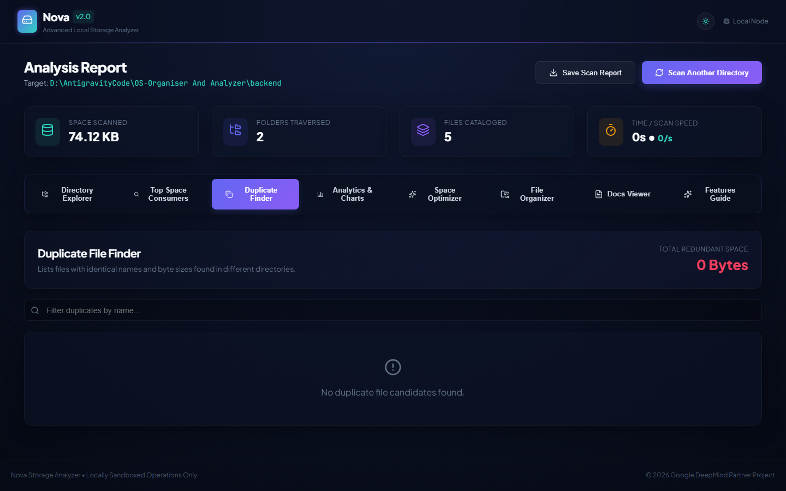
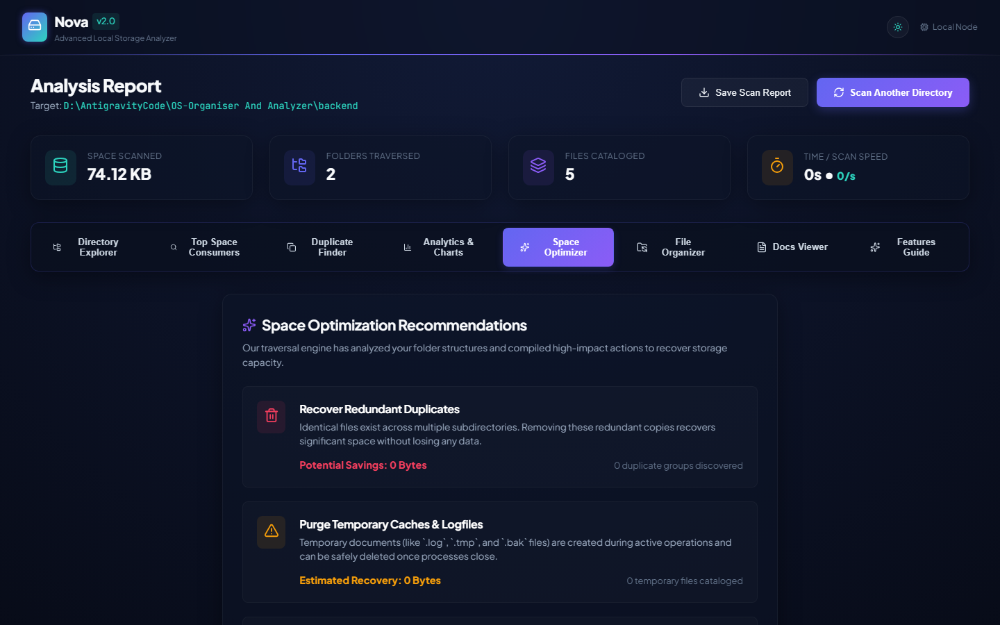

# 🚀 Nova Disk Space Analyzer

> **Last Updated**: May 25, 2026, 6:46 PM (Local Time: 2026-05-25T18:46:00+02:00)
> **Branch**: `main` (synchronized with remote GitHub repository)

Nova Disk Space Analyzer is a highly responsive, locally run web application that traverses your hard drives and projects, visualizing directory sizes using interactive **squarified SVG treemaps** (WinDirStat-style), listing candidate duplicate files, grouping file extensions, and exposing an advanced space-hog search tool.

All file exploration operations are strictly **read-only**, guaranteeing complete system safety.

---

## 🎯 Key Features

1. **Automatic Drive Detection**: Instantly detects and lists Windows local drives (`C:\`, `D:\`, etc.) with used vs. free storage gauges.
2. **Custom Directory Scan**: Supports scanning any custom absolute filesystem directory or project path.
3. **Live Progress HUD Banner**: Visual neon-glowing scanner radar showing scanning speeds (files/sec), elapsed time, total cataloged objects, remaining ETA, and Play/Pause/Abort actions.
4. **Instant Background Scanning**: Starts scanning and immediately redirects to the Results dashboard, live-updating treemaps, folder list tables, and analytics charts in the background.
5. **WinDirStat-style Interactive Treemap**: Pure React-engineered recursive SVG treemap. Larger blocks represent larger space consumers, categorized by extensions, with support for hovering tooltips and folder drill-downs.
6. **Split-Layout Folder Explorer**: Interactive table displaying files and subdirectories with custom progress bars representing their exact relative space allocations within the parent.
7. **Redundant Duplicate Finder**: Maps candidate duplicates (identical filename + byte size) across your folders, displaying wasted capacity summaries and file locations.
8. **Smart Space Diagnostics**: Recommends cache cleanup, redundant items, and recursive inactive developer dependencies (e.g. `node_modules`) to recover gigabytes.
9. **Dedicated File Organizer**: Category-grouped preview lists (dry-run) and secure, atomic sorting rearrangement moves that group loose files into clean subdirectories (Documents, Images, Media, Audio, Archives, Installers) under user approval, writing an `organize_report_[timestamp].txt` track log.
10. **Interactive Project Docs & Guide Viewers**: Scrollable split view displaying system Markdown guides natively in-app.
11. **High-Contrast Dual Themes**: Seamlessly switch between Space Dark Mode and fully optimized glassmorphic Light Mode with high-contrast slate text.
12. **Automated Feature Screenshots**: Auto-installs Playwright to launch Chromium and captures 11 full-feature Dark/Light screenshots in a `/screenshots` folder.

---

## 🧱 Technical Stack

- **Backend**: Python 3.14 + FastAPI + Uvicorn + `psutil` (system drives explorer).
- **Frontend**: React (Vite) + TypeScript + Vanilla CSS + Lucide Icons + Recharts (file category charts) + Custom Aspect-Ratio Treemap.
- **Aesthetic Theme**: Premium deep-space neon glow variables (`#060913`), frosted glassmorphic card boundaries, fluid micro-animations, and styled scrollbar tracks.

---

## 📂 Project Structure

```
D:\AntigravityCode\OS-Organiser And Analyzer\
├── backend/
│   ├── main.py              # FastAPI endpoints, CORS static file serving, export / docs APIs
│   ├── scanner.py           # Multi-threaded os.scandir directory traversal & file organizer
│   └── requirements.txt     # Backend python dependencies (fastapi, uvicorn, psutil)
├── frontend/
│   ├── src/
│   │   ├── components/
│   │   │   ├── Breadcrumbs.tsx   # Windows path separator breadcrumbs navigator
│   │   │   ├── Dashboard.tsx     # Main diagnostics and navigation tab coordinator
│   │   │   ├── DiskSelector.tsx  # Local partitions grid picker card
│   │   │   ├── DuplicatesTab.tsx # Identical filename + size duplicate results finder
│   │   │   ├── FileExplorer.tsx  # Traversal tables with relative space gauges
│   │   │   ├── FileTypeChart.tsx # Horizontal Recharts visual categories size charts
│   │   │   ├── SearchFilter.tsx  # Advanced space hogs size filter search engine
│   │   │   ├── Treemap.tsx       # Aspect-ratio aspect-ratio-optimized squarified SVGs
│   │   │   ├── OptimizerTab.tsx  # Space cleanup recommendations and diagnostic guides
│   │   │   ├── OrganizerTab.tsx  # Dedicated file organizer dry-run preview and track log
│   │   │   ├── DocsTab.tsx       # In-app interactive Markdown guide files viewer
│   │   │   └── FeaturesTab.tsx   # Onboarding visuals illustrating major features
│   │   ├── App.tsx               # State coordinator, non-blocking scan intervals, pausers
│   │   ├── index.css             # Fluid dark/light neon variables and class properties
│   │   ├── main.tsx              # React client entry point
│   │   └── types.ts              # System TypeScript types interfaces
│   ├── index.html
│   ├── package.json
│   ├── tsconfig.json
│   └── vite.config.ts
├── screenshots/             # Automatically generated feature snapshots (Dark & Light)
├── take_screenshots.py      # Automated Playwright headless chromium screenshot suite
├── implementation_plan.md   # Architectural blueprint
├── task.md                  # Development checklists
├── walkthrough.md           # Implementation completion details
├── prompts_log.md           # Historic prompt logs and chronological milestones
├── run.py                   # Production single-click integrated launcher
└── run_dev.py               # Concurrent developer server runner
```

---

## 🖼️ Application Visual Showcase

Here is a visual tour of **Nova v2.0** illustrating its glassmorphic interface, dark/light themes, and core feature panels.

### 1. Unified Startup Hub (Space Dark vs. Frosted Light)
Choose custom folders, scan all local drives, and toggle skip optimizations (Hidden Folders, Dependency Packages, or Source Code) with real-time Admin Mode detection.

| Space Dark Startup | Frosted Glass Light Startup |
| :---: | :---: |
|  |  |

---

### 2. Live Background Scanning & Squarified Treemap
Scan drives in the background while browsing directories. Larger blocks in the SVG Treemap represent larger space consumers, categorized by extension categories.

| Background Scanning Progress HUD | Interactive SVG Treemap & Explorer |
| :---: | :---: |
|  |  |

---

### 3. Secure File Organizer Sorter Tab
Prefill paths or use the native folder selector. Review sorting dry-run categorization previews before rearranging, then approve to execute and log tracked operations.

| Sorter Tab Layout & Dry-Run Preview |
| :---: |
|  |

---

### 4. Smart Space Optimizer Action Center & Duplicate Finder
Examine redundant identical file copies with size wasted meters, log cache files, and developer dependency folders.

| Redundant Duplicate Finder | Space Optimizer Dashboard |
| :---: | :---: |
|  |  |

---

## 🚀 Getting Started

### Option A: Standard Single-Click Mode (Recommended)
This script prepares everything, builds the frontend static package, opens your browser automatically, and spins the local FastAPI service:
1. Open a terminal in the root directory:
   ```powershell
   python run.py
   ```
2. Navigate to `http://localhost:8000` in your web browser (if it doesn't open automatically).

### Option B: Concurrent Developer Mode
Ideal for developers looking to modify files, styles, or add backend endpoints with hot-module reload support:
1. Open a terminal in the root directory:
   ```powershell
   python run_dev.py
   ```
2. The launcher spins the FastAPI backend on `http://localhost:8000` and the Vite React server on `http://localhost:5173`.
3. Open your browser and navigate to `http://localhost:5173`. Press `Ctrl+C` in your terminal to shut down both processes.

### Option C: Deployed Web Console (GitHub Pages Hybrid Mode)
Access the live hosted frontend directly on the web, communicating securely with your locally running machine scanner controller:
1. Spin up your local Python controller on port 8000:
   ```powershell
   python run.py
   ```
2. Navigate to your custom live hosted URL in any browser:
   [https://thannasudhir9.github.io/DriveOrganiserAndAnalyzer-AG2.0/](https://thannasudhir9.github.io/DriveOrganiserAndAnalyzer-AG2.0/)

---

## 🌐 Hybrid Architecture & Mixed Content Resolutions

GitHub Pages hosts static React clients securely via HTTPS. However, browsers restrict HTTPS web pages from sending asynchronous XHR/Fetch queries to insecure local addresses (`http://localhost:8000`) by default under **Mixed Content Security Rules**.

To make this seamless and robust, Nova implements the following intelligent behaviors:

### 1. Glassmorphic Connection Diagnostics Card
If the deployed site is unable to establish an active connection to your local Python scanner, the UI dynamically replaces the drive selection panel with a sleek **GitHub Pages Security Block Diagnostic Card**. This instructs you to:
- Click the site lock/settings icon in the browser's address bar.
- Open **Site Settings**.
- Locate **Insecure Content** and change it to **Allow**.
- Reload the page. This securely bridges remote-to-local communication on standard Chromium and Gecko browsers.

### 2. "Scan Manually" Bypass Mode
For users who prefer not to run a local backend server or cannot change browser security settings, a glowing **Scan Manually &rarr;** button is provided on the Diagnostic Card. Clicking it bypasses the connection checks and directs you to custom path entry forms for manual diagnostics.

### 3. Universal Relative Asset Pipelines
- **Vite Configuration**: We configured `base: './'` in [vite.config.ts](file:///d:/AntigravityCode/OS-Organiser%20And%20Analyzer/frontend/vite.config.ts). This ensures all compiled React JS/CSS scripts, logo vectors, and charts resolve using relative file locations rather than absolute roots, making it fully portable under subfolder repositories.
- **Relative Favicon Mapping**: Updated `index.html` to load `./favicon.svg` relatively, resolving a 404 asset loading error on GitHub Pages.
- **Dynamic API Resolving**: In [DiskSelector.tsx](file:///d:/AntigravityCode/OS-Organiser%20And%20Analyzer/frontend/src/components/DiskSelector.tsx), the app automatically determines its hostname:
  - If running on `localhost` or `127.0.0.1`, it utilizes relative endpoints (`""`) served directly by Uvicorn.
  - If running on a remote host (e.g. GitHub Pages), it dynamically targets the local backend server at `http://localhost:8000`.

### 4. Updating the Hosted Site (Deployment Pipeline)
To build and push fresh updates to the hosted website, run:
```powershell
cd frontend
npm run deploy
```
*This triggers TypeScript compilation, builds minified static assets in `/dist`, and utilizes the `gh-pages` npm package to commit and push the build directly to your remote repository's `gh-pages` branch.*


