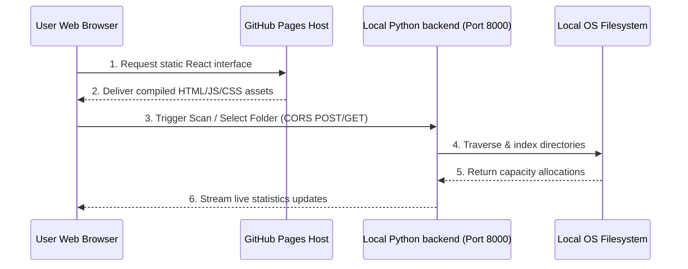

# 🌐 Nova Disk Space Analyzer - GitHub Pages Deployment Manual

> **Last Updated**: May 25, 2026, 6:46 PM (Local Time: 2026-05-25T18:46:00+02:00)
> **Branch**: `main` / `gh-pages` (synchronized with remote GitHub repository)
> **Manual Type**: Deployment & Remote Administration

This document outlines the architecture, configuration changes, and step-by-step procedures to deploy the **Nova Disk Space Analyzer** frontend interface to **GitHub Pages** while retaining local filesystem scanning and organization capabilities.

---

## 🧱 1. Understanding the Hybrid Architecture

GitHub Pages is a static-only web hosting service. It serves client-side assets (HTML, CSS, JavaScript, icons, and Recharts vectors) directly to browser client environments, but it **cannot run server-side executables** (like Python 3.14, FastAPI frameworks, or `psutil` partition collectors).

To enable full filesystem operations from a remote web host, Nova uses a **Dynamic Hybrid Model**:



1. **Static Client serving**: You visit your custom hosted GitHub Pages website URL: `https://thannasudhir9.github.io/DriveOrganiserAndAnalyzer-AG2.0/`.
2. **Local ASGI Controller**: You run `python run.py` on your local host to start the FastAPI server on `http://127.0.0.1:8000`.
3. **Cross-Origin queries**: When you trigger scans or folder sorting, the remote interface queries the local server. Since the backend `CORSMiddleware` in `backend/main.py` is configured to allow all cross-origin requests (`allow_origins=["*"]`), the browser permits direct local filesystem control safely and securely!

---

## ⚙️ 2. Deployment Configurations Created

We completed two primary configurations inside the `/frontend` project folder:

### A. Relative Base Path Configuration (`frontend/vite.config.ts`)
We updated the Vite configuration to compile asset references using a relative base (`base: './'`). This guarantees that script chunks, styles, and images are retrieved correctly under **both** local roots and subfolder repositories:

```typescript
import { defineConfig } from 'vite'
import react from '@vitejs/plugin-react'

export default defineConfig({
  base: './', // Enforces relative path builds for universal portability!
  plugins: [react()],
})
```

### B. Deployment Scripts & Dev Dependencies (`frontend/package.json`)
We installed the `gh-pages` npm package as a development dependency and mounted deployment pipeline commands:

```json
  "scripts": {
    "dev": "vite",
    "build": "tsc -b && vite build",
    "predeploy": "npm run build",
    "deploy": "gh-pages -d dist",
    "lint": "eslint .",
    "preview": "vite preview"
  }
```
- **predeploy**: Automatically runs TypeScript syntax verification (`tsc -b`) and minifies assets (`vite build`) into a clean `/dist` output directory.
- **deploy**: Leverages Git to create a clean `gh-pages` branch locally, commit the compiled static assets in `/dist`, and push it directly to the remote GitHub repository branch `gh-pages`.

---

## 🚀 3. Steps to Deploy & Update the Website

Follow these simple commands to push updates to the live website:

### Step 1: Open Terminal in Frontend Folder
Open your terminal inside the `/frontend` directory:
```powershell
cd frontend
```

### Step 2: Trigger the Automated Deploy Command
Run the deployment script:
```powershell
npm run deploy
```
*This minifies all React assets, creates the local static deploy commit, and pushes the `/dist` directory directly to your remote repository's `gh-pages` branch.*

---

## 🖥️ 4. Running and Using Your Live Console

Once the website is live, follow these steps to manage your disk space:

1. **Boot your local scanner controller**:
   Open a terminal in the project's root folder on your machine and run:
   ```powershell
   python run.py
   ```
   *(Keep this terminal open so port `8000` stays active to read/write disk files).*

2. **Access your remote console**:
   Navigate to your personal hosted live website URL in any browser:
   ```
   https://thannasudhir9.github.io/DriveOrganiserAndAnalyzer-AG2.0/
   ```
   *Nova's glassmorphic interface will load immediately, detect the active local node, and let you scan drives, view treemaps, find duplicates, and organize folders globally!*

---

## 🔒 5. Browser Mixed-Content and Asset Resolutions

Deploying an HTTPS-based static client that communicates with an insecure local HTTP endpoint (`http://localhost:8000`) introduces technical barriers that Nova solves dynamically:

### A. Favicon 404 Resolution
- **Issue**: Vite's default path resolver doesn't rewrite absolute favicon definitions (`href="/favicon.svg"`) under subfolder hosted environments like `/DriveOrganiserAndAnalyzer-AG2.0/`, triggering a 404 image load warning.
- **Resolution**: Updated `index.html` to reference relative `./favicon.svg`, aligning asset resolution perfectly with our relative base bundler paths.

### B. Dynamic Host API base Resolution
- In [DiskSelector.tsx](file:///d:/AntigravityCode/OS-Organiser%20And%20Analyzer/frontend/src/components/DiskSelector.tsx), the `API_BASE` is resolved dynamically:
  ```typescript
  const API_BASE = window.location.hostname === 'localhost' || window.location.hostname === '127.0.0.1'
    ? ''
    : 'http://localhost:8000';
  ```
  This ensures that when run locally, the browser uses standard relative routes. When hosted remotely, it targets port `8000` on the user's local loopback network.

### C. Glassmorphic Connection Diagnostics Card & Scan Manually Fallback
- If the browser blocks the backend request, the drives loading panel is replaced with a **GitHub Pages Security Block Card**.
- This guides the user through relaxing Mixed Content restrictions for this site via browser **Site Settings** (changing *Insecure Content* to *Allow*).
- An alternate **Scan Manually &rarr;** button is exposed to let users access folder scanning forms directly without requiring immediate server handshake checks.
